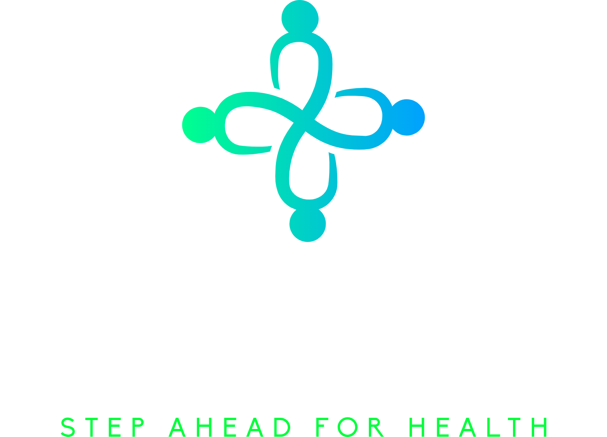

# NextStep - Civic Engagement Platform  
<div align="center">
  <br/>
</div> 

## 🚀 About the Project  
NextStep is a **React Native** application developed during the **Odoo x CHARUSAT Hackathon** to empower marginalized communities by providing tools for civic engagement. The platform helps users **influence policy decisions, report local issues, and participate in community initiatives**.

## 📌 Problem Statement  
Marginalized communities often **struggle to access public services or influence policy decisions** that affect them, limiting their ability to drive positive social change.

## 💡 Our Solution  
NextStep bridges the gap between **local authorities and citizens** by providing:  
- **Community Initiatives** – Crowdsourcing ideas for public improvement (waste management, park development, etc.).  
- **Access to Services** – Streamlined interfaces for applying for government benefits, reporting issues, and accessing health services.  
- **Policy Participation** – Tools for tracking local government actions, participating in surveys, and contacting representatives.

---

## 👨‍💻 Team Neutron  
| Name                  | Role               | GitHub ID                                 |
|-----------------------|--------------------|--------------------------------------------|
| **Dev Agrawal**        | Backend Developer  | [@dev261004](https://github.com/dev261004) |
| **Pradeep Prajapati**  | Frontend Developer | [@Pradeep-1496](https://github.com/Pradeep-1496) |

---

## 🛠️ Tech Stack  
- **Frontend:** React Native, Expo  
- **Backend:** Node.js, Express.js  
- **Database:** MongoDB  
- **Authentication:** JWT/Auth0  
- **Notifications & Communication:** Twilio  
- **Maps & Location Services:** Google Maps API  

---

## 📱 Screenshots  
| Home Page | Communities | Surveys |  
|-----------|-------------|---------|  
|  |  |  |  

---

## 🎯 Features  
✔️ **Crowdsourced Ideas** – Suggest and vote for local development projects.  
✔️ **Community Discussions** – Engage in topic-specific forums.  
✔️ **Policy Tracking & Surveys** – Keep up with policy updates and participate in feedback.  
✔️ **Service Requests** – Report issues like potholes, garbage dumps, water leaks, etc.  
✔️ **Authentication & Security** – JWT-based authentication ensures user data is protected.  
✔️ **Real-Time Notifications** – Alerts and updates using Twilio and push notifications.  

---

## 🏗️ Installation  

### 📋 Prerequisites  
- [Node.js](https://nodejs.org/)  
- [Expo CLI](https://docs.expo.dev/get-started/installation/)  
- [MongoDB](https://www.mongodb.com/)  

### ⚙️ Steps to Run Locally  

1. **Clone the Repository**  
   ```bash
   git clone https://github.com/dev261004/NextStep.git
   cd NextStep
   ```

2. **Install Dependencies**  
   ```bash
   npm install
   ```

3. **Start the Backend Server**  
   ```bash
   cd server
   npm install
   npm start
   ```

4. **Start the Expo App**  
   ```bash
   cd ../frontend
   npm install
   npm start
   ```

5. **Connect MongoDB**  
   - Create a `.env` file in the `server` folder.  
   - Add your MongoDB URI and JWT secret:  
     ```
     MONGO_URI=your_mongo_connection_string
     JWT_SECRET=your_jwt_secret
     ```

---
